# MeridianOps — Airport Ground Operations Management System

**Project type:** C# / .NET 10 Console Application
**Author:** Mohammad Shaqboua
**Repository:** https://github.com/Mohammadshaqboua/MeridianOps.git

A console-based ground operations system for a single airport terminal ("Meridian Terminal Operations"). It handles flight registration and gate assignment, passenger registration and boarding, cumulative baggage tracking, seat booking with an automatic standby list, and ground-staff duty-hour tracking — all through a menu-driven CLI backed by an in-memory data layer.

---

## Table of Contents

1. [How to Run](#how-to-run)
2. [Feature Summary](#feature-summary)
3. [Project Structure](#project-structure)
4. [Enums](#enums)
5. [Models](#models)
6. [Common — AppConfig & InputValidator](#common--appconfig--inputvalidator)
7. [Services](#services)
8. [ConsoleMenu — CLI Flow](#consolemenu--cli-flow)
9. [Class Diagram](#class-diagram)
10. [Design Decisions](#design-decisions)
11. [Known Limitations](#known-limitations)

---

## How to Run

### Prerequisites
- [.NET 10 SDK](https://dotnet.microsoft.com/download) installed (the project targets `net10.0`).
- Windows, macOS, or Linux with the `dotnet` CLI available, or JetBrains Rider / Visual Studio 2022+.

### Run from the command line
```bash
cd MeridianOps/MeridianOps
dotnet run
```

### Run from an IDE
1. Open `MeridianOps.sln` in Rider or Visual Studio.
2. Set `MeridianOps` as the startup project.
3. Run/Debug (F5).

### Using the application
The app boots into a looping text menu:

```
=== Meridian Terminal — Ground Operations System ===
  [1]  Register Flight
  [2]  Assign Gate
  [3]  Register Passenger
  [4]  Check Boarding Eligibility
  [5]  Baggage Management
  [6]  Booking & Standby Management
  [7]  Assign Staff
  [8]  Register Gate
  [9]  Register Staff
  [10] Update Flight Status
  [11] View All Flights
  [12] View All Gates
  [13] Exit
```

Every operation prints a labelled result (`[ SUCCESS ]`, `[ ERROR ]`, or a specific `[ REASON ]`) so staff always know exactly why an operation succeeded or failed.

> **Note:** All data lives in memory for the lifetime of the process — nothing is persisted to disk or a database. Closing the app discards all flights, gates, passengers, bookings, baggage, and staff.

### Typical workflow
1. **Register Flight** (option 1) to create a flight and get a generated `FlightNumber` (e.g. `FL-1`).
2. **Register Gate** (option 8) to create a gate and get a generated `GateId` (e.g. `G-1`), then **Assign Gate** (option 2) to link a flight to it.
3. **Register Passenger** (option 3) to create a passenger and get a generated `PassengerId` (e.g. `P-1`) — optionally linking them to an earlier connecting flight.
4. **Book Passenger** (option 6 → 1) to confirm a seat, or place them on standby if the flight is full.
5. **Register Baggage** (option 5 → 1) for that passenger against a specific flight.
6. **Check Boarding Eligibility** (option 4) to verify connection time before boarding, then **Process Boarding** (option 6 → 4) to confirm the passenger actually boarded.
7. **Register Staff** (option 9) and **Assign Staff** (option 7) to staff flights or gates while tracking duty hours.
8. Use **View All Flights / Gates** (options 11–12) at any time to see everything registered so far.

---

## Feature Summary

| Area | Implemented Features |
|---|---|
| **Flight & Gate Management** | Register flights with type (Domestic/International), schedule, and seat capacity (auto-generated `FlightNumber`); register gates with an international-support flag (auto-generated `GateId`); assign a flight to a gate while **preventing overlapping gate-occupancy windows** and **enforcing the international-flight/gate-support restriction**; update flight status (Scheduled/Delayed/Boarding/Departed/Cancelled) while preventing status changes on flights that have already departed or been cancelled. |
| **Passenger Registration** | Register passengers with a category (Standard/VIP/ReducedMobility) and an optional link to an earlier connecting flight — kept fully separate from booking a seat. |
| **Boarding & Connections** | **Check Boarding Eligibility** verifies the flight isn't departed/cancelled and, for connecting passengers, that enough time remains between the connecting flight's arrival and the next flight's departure (configurable minimum), rejecting with the exact number of minutes short. **Process Boarding** is a separate confirmation step that re-runs the eligibility check, requires a confirmed booking, marks the passenger as boarded, and prevents boarding the same passenger twice. |
| **Baggage** | Register one or more bags per passenger per flight; tracks the **combined weight of all of a passenger's bags on that flight** against a per-category allowance, rejecting any bag that would push the running total over the limit — even if that bag alone is within a normal single-bag limit — with a dynamic message stating the resulting total and the allowance. |
| **Booking & Standby** | Book a passenger onto a flight; if the flight is full, automatically place them on a **standby list** (capped at a configurable size); cancel a confirmed booking, which **automatically promotes the earliest standby passenger** to a confirmed seat (FIFO); view a flight's ordered standby list. |
| **Ground Staff** | Register staff members; assign a staff member to a flight or a gate for a given duration while tracking **cumulative duty hours across all of their assignments**, rejecting any new assignment that would push their total over a configurable maximum — even if that single assignment looks short on its own; view a staff member's cumulative hours. |
| **Reporting** | View all registered flights (with type, status, schedule, capacity, and assigned gate) and all registered gates (with international support and assigned-flight count) at any time. |
| **CLI** | Menu-driven console interface with safe input parsing (re-prompts on non-numeric input instead of crashing), clear `[ SUCCESS ]` / `[ ERROR ]` / `[ REASON ]` messaging for every operation, and a continuous loop until Exit. |

---

## Project Structure

```
MeridianOps/
└── MeridianOps/
    ├── Program.cs                   # CLI entry point (top-level statements)
    ├── Enums/
    │   ├── FlightType.cs
    │   ├── FlightStatus.cs
    │   ├── PassengerCategory.cs
    │   └── BookingStatus.cs
    ├── Models/
    │   ├── OperationResult.cs
    │   ├── Flight.cs
    │   ├── Gate.cs
    │   ├── Passenger.cs
    │   ├── Baggage.cs
    │   ├── Booking.cs
    │   ├── GroundStaff.cs
    │   └── Assignment.cs
    ├── Common/
    │   ├── AppConfig.cs
    │   └── InputValidator.cs
    ├── Services/
    │   ├── FlightService.cs
    │   ├── GateService.cs
    │   ├── PassengerService.cs
    │   ├── BaggageService.cs
    │   ├── BookingService.cs
    │   └── StaffService.cs
    └── UI/
        └── ConsoleMenu.cs
```

---

## Enums

| Enum | Values | Purpose |
|---|---|---|
| `FlightType` | `Domestic`, `International` | Type of a flight; drives the gate international-support restriction. |
| `FlightStatus` | `Scheduled`, `Delayed`, `Boarding`, `Departed`, `Cancelled` | Operational status of a flight; controls whether boarding/baggage/status-update operations are allowed. |
| `PassengerCategory` | `Standard`, `VIP`, `ReducedMobility` | Classification of a passenger; determines their baggage weight allowance. |
| `BookingStatus` | `Confirmed`, `Standby`, `Cancelled` | Lifecycle state of a booking, including its position on a flight's standby list. |

---

## Models

All model classes live in the `MeridianOps.Models` namespace. They are largely data holders; validation and business rules live in the service layer, with a few self-contained helper methods on `OperationResult`, `Flight`, `Gate`, `Passenger`, and `GroundStaff`.

### `OperationResult`

| Property | Type | Description |
|---|---|---|
| `Success` | `bool` | Read-only; whether the operation succeeded. |
| `Message` | `string` | Read-only; a specific, human-readable outcome or failure reason. |

**Methods:** `Ok(message)` *(static)* and `Fail(reason)` *(static)* — the only two ways to construct an instance (the constructor is `private`). This guarantees every operation reports both whether it succeeded and a specific reason, never a generic error.

### `Flight`

| Property | Type | Description |
|---|---|---|
| `FlightNumber` | `string` | Unique ID, auto-generated as `FL-{n}`. |
| `Type` | `FlightType` | Domestic / International. |
| `ArrivalTime` | `DateTime` | Scheduled arrival time. |
| `DepartureTime` | `DateTime` | Scheduled departure time. |
| `SeatCapacity` | `int` | Confirmed-seat limit. |
| `Status` | `FlightStatus` | Defaults to `Scheduled`. |
| `AssignedGate` | `Gate?` | Nullable — a flight may exist before it's assigned a gate. |
| `Bookings` | `List<Booking>` | All confirmed and standby bookings for this flight. |

**Methods:** `GetConfirmedCount()`, `HasAvailableSeat()`, `GetStandbyListOrdered()` (oldest first, by `BookingTime`), `GetGateOccupancyWindow()` (the single, documented definition of when a flight occupies its gate — see [Design Decisions](#design-decisions)).

### `Gate`

| Property | Type | Description |
|---|---|---|
| `GateId` | `string` | Unique ID, auto-generated as `G-{n}`. |
| `SupportsInternational` | `bool` | Whether this gate may host international flights. |
| `AssignedFlights` | `List<Flight>` | Every flight ever assigned to this gate, used for overlap checks. |

**Methods:** `IsAvailable(start, end)` — checks the requested window against every already-assigned flight's window for a time overlap.

### `Passenger`

| Property | Type | Description |
|---|---|---|
| `PassengerId` | `string` | Unique ID, auto-generated as `P-{n}`. |
| `Name` | `string` | Passenger's full name. |
| `Category` | `PassengerCategory` | Standard / VIP / ReducedMobility; drives the baggage allowance. |
| `ConnectingFlight` | `Flight?` | Nullable; the earlier (arrival) leg, if the passenger is connecting. |
| `BaggageItems` | `List<Baggage>` | All bags registered for this passenger, across any flight. |

**Methods:** `GetTotalBaggageWeight(flight)` (sums only bags tied to the given flight), `IsConnectingPassenger()`.

### `Baggage`

| Property | Type | Description |
|---|---|---|
| `BaggageId` | `string` | Unique ID, auto-generated as `B-{n}`. |
| `WeightKg` | `double` | Weight of this single bag. |
| `Owner` | `Passenger` | The passenger this bag belongs to. |
| `Flight` | `Flight` | The specific flight this bag is checked in for. |

**Methods:** none — a pure data holder.

### `Booking`

| Property | Type | Description |
|---|---|---|
| `Passenger` | `Passenger` | The passenger holding this booking. |
| `Flight` | `Flight` | The flight this booking is for. |
| `Status` | `BookingStatus` | Confirmed / Standby / Cancelled. |
| `BookingTime` | `DateTime` | Defaults to `DateTime.Now`; used to order the standby list (FIFO). |
| `HasBoarded` | `bool` | Defaults to `false`; set once `ProcessBoarding` succeeds. |

**Methods:** none — a pure data holder; all state changes are made directly by the service layer.

### `GroundStaff`

| Property | Type | Description |
|---|---|---|
| `StaffId` | `string` | Unique ID, auto-generated as `S-{n}`. |
| `Name` | `string` | Staff member's full name. |
| `Assignments` | `List<Assignment>` | Every assignment given to this staff member during the shift. |

**Methods:** `GetTotalHoursWorked()` — sums `DurationHours` across all assignments.

### `Assignment`

| Property | Type | Description |
|---|---|---|
| `Staff` | `GroundStaff` | The staff member being assigned. |
| `Flight` | `Flight?` | Nullable; set when this assignment is to a flight. |
| `Gate` | `Gate?` | Nullable; set when this assignment is to a gate. |
| `DurationHours` | `double` | Hours this assignment contributes to the staff member's duty total. |

**Methods:** none — a pure data holder.

---

## Common — AppConfig & InputValidator

### `AppConfig`
A static class holding every configurable business threshold in one place, each chosen deliberately and applied consistently across the relevant services:

| Constant | Value | Reasoning |
|---|---|---|
| `MinConnectionMinutes` | `45` | A commonly used minimum for domestic-style connections at a mid-sized single-terminal airport — enough time to disembark, move through the terminal, and reach the next gate. |
| `MaxDutyHours` | `8` | A standard full working shift for ground staff, matching a typical single-shift labor day. |
| `StandbyCapacity` | `10` | A bounded, reasonable waitlist size — large enough to be useful on an oversold flight, small enough to remain manageable for gate agents to track and call in order. |
| `BaggageAllowanceByCategory(category)` | Standard = `30kg`, VIP = `40kg`, ReducedMobility = `35kg` | Standard mirrors a typical economy checked-baggage allowance; VIP is granted a higher allowance as a service perk; ReducedMobility is set slightly above Standard as a practical accommodation. |

### `InputValidator`
Static helpers (`ReadInt`, `ReadDouble`, `ReadDateTime`, `ReadNonEmptyString`) that loop and re-prompt on invalid input using `TryParse`, ensuring the CLI never crashes on non-numeric or empty input — directly satisfying the Phase 4 requirement to handle bad input gracefully.

---

## Services

Each service is a plain class holding its own in-memory list (or, for `BaggageService` and `BookingService`, operating directly on data already stored inside `Passenger`/`Flight` to avoid duplicated state) plus a sequential counter used to auto-generate IDs.

### `FlightService`
`RegisterFlight(type, arrival, departure, capacity)` (auto-generates `FlightNumber`); `UpdateStatus(flightNumber, newStatus)` (rejects updates to flights that are already `Departed` or `Cancelled`); `FindFlight(flightNumber)`; `GetAllFlights()`.

### `GateService`
`RegisterGate(supportsInternational)` (auto-generates `GateId`); `AssignGate(flightNumber, gateId, flightService)` — validates the flight and gate exist, rejects an international flight assigned to a gate that doesn't support international traffic, and rejects the assignment if `gate.IsAvailable(...)` (checked against `flight.GetGateOccupancyWindow()`) reports an overlap; `FindGate(gateId)`; `GetAllGates()`.

### `PassengerService`
`RegisterPassenger(name, category, connectingFlight)` (auto-generates `PassengerId`); `CheckBoardingEligibility(passengerId, nextFlightNumber, flightService)` — rejects if the flight is `Departed`/`Cancelled`, and for connecting passengers rejects with the exact minutes short if the gap between the connecting flight's arrival and the next flight's departure is below `AppConfig.MinConnectionMinutes`; `FindPassenger(passengerId)`.

### `BaggageService`
`RegisterBaggage(passengerId, flightNumber, weightKg, passengerService, flightService)` (auto-generates `BaggageId`) — rejects baggage on a `Departed`/`Cancelled` flight, and rejects any bag that would push the passenger's running total on that flight over their category's allowance, reporting the exact resulting total and limit; `GetTotalWeight(...)` for display.

### `BookingService`
`BookPassenger(passengerId, flightNumber, passengerService, flightService)` — confirms a seat if one is available, otherwise adds the passenger to standby (rejecting outright if the standby list is already at `AppConfig.StandbyCapacity`); `CancelBooking(...)` — cancels a confirmed booking and calls the private `PromoteFromStandby(flight)` helper, which automatically confirms the earliest standby booking; `ProcessBoarding(passengerId, flightNumber, passengerService, flightService)` — re-runs `CheckBoardingEligibility`, requires a confirmed booking, rejects a passenger who has already boarded, and marks `Booking.HasBoarded = true`; `GetStandbyList(...)` for display.

### `StaffService`
`RegisterStaff(name)` (auto-generates `StaffId`); `AssignStaff(staffId, flight, gate, durationHours)` — rejects any assignment that would push the staff member's cumulative duty hours over `AppConfig.MaxDutyHours`, reporting the resulting total and the maximum; `GetCumulativeHours(staffId)`.

---

## ConsoleMenu — CLI Flow

`Program.cs` is a top-level-statements entry point that constructs one instance of each of the six services and passes them into a single `ConsoleMenu`, then calls `menu.Run()`.

`ConsoleMenu.Run()` loops indefinitely, printing the main menu and reading a choice via `InputValidator.ReadInt`. Each numbered option dispatches to a dedicated `HandleX()` method that:
1. Prompts for the required inputs (using `InputValidator` for safe parsing, and small numbered sub-menus for enum choices such as flight type or passenger category).
2. Calls the matching service method.
3. Prints the result through shared helpers (`PrintSuccess`, `PrintError`, `PrintResult`) that always show a specific reason on failure, never a generic error.

Sub-menus exist for **Baggage Management** (Register Baggage / View Cumulative Weight) and **Booking & Standby Management** (Book Passenger / Cancel Booking / View Standby List / Process Boarding), keeping the top-level menu compact. The loop only exits when option 13 (Exit) is chosen.

---

## Class Diagram

```mermaid
classDiagram
    class Flight {
        +string FlightNumber
        +FlightType Type
        +DateTime ArrivalTime
        +DateTime DepartureTime
        +int SeatCapacity
        +FlightStatus Status
        +Gate AssignedGate
        +List~Booking~ Bookings
        +GetConfirmedCount() int
        +HasAvailableSeat() bool
        +GetStandbyListOrdered() List~Booking~
        +GetGateOccupancyWindow() Tuple
    }
    class Gate {
        +string GateId
        +bool SupportsInternational
        +List~Flight~ AssignedFlights
        +IsAvailable(start, end) bool
    }
    class Passenger {
        +string PassengerId
        +string Name
        +PassengerCategory Category
        +Flight ConnectingFlight
        +List~Baggage~ BaggageItems
        +GetTotalBaggageWeight(flight) double
        +IsConnectingPassenger() bool
    }
    class Booking {
        +Passenger Passenger
        +Flight Flight
        +BookingStatus Status
        +DateTime BookingTime
        +bool HasBoarded
    }
    class Baggage {
        +string BaggageId
        +double WeightKg
        +Passenger Owner
        +Flight Flight
    }
    class GroundStaff {
        +string StaffId
        +string Name
        +List~Assignment~ Assignments
        +GetTotalHoursWorked() double
    }
    class Assignment {
        +GroundStaff Staff
        +Flight Flight
        +Gate Gate
        +double DurationHours
    }
    class OperationResult {
        +bool Success
        +string Message
        +Ok(message)$ OperationResult
        +Fail(reason)$ OperationResult
    }
    class AppConfig {
        +int MinConnectionMinutes$
        +double MaxDutyHours$
        +int StandbyCapacity$
        +GetBaggageAllowance(category)$ double
    }
    class FlightService {
        +RegisterFlight(type, arrival, departure, capacity) OperationResult
        +UpdateStatus(flightNumber, newStatus) OperationResult
        +FindFlight(flightNumber) Flight
        +GetAllFlights() List~Flight~
    }
    class GateService {
        +RegisterGate(supportsIntl) OperationResult
        +AssignGate(flightNumber, gateId, flightService) OperationResult
        +FindGate(gateId) Gate
        +GetAllGates() List~Gate~
    }
    class PassengerService {
        +RegisterPassenger(name, category, connectingFlight) OperationResult
        +CheckBoardingEligibility(passengerId, nextFlightNumber, flightService) OperationResult
        +FindPassenger(passengerId) Passenger
    }
    class BaggageService {
        +RegisterBaggage(passengerId, flightNumber, weightKg, ...) OperationResult
        +GetTotalWeight(passengerId, flightNumber, ...) double
    }
    class BookingService {
        +BookPassenger(passengerId, flightNumber, ...) OperationResult
        +CancelBooking(passengerId, flightNumber, ...) OperationResult
        +ProcessBoarding(passengerId, flightNumber, ...) OperationResult
        +GetStandbyList(flightNumber, flightService) List~Booking~
    }
    class StaffService {
        +RegisterStaff(name) OperationResult
        +AssignStaff(staffId, flight, gate, durationHours) OperationResult
        +GetCumulativeHours(staffId) double
    }
    class ConsoleMenu {
        +Run() void
    }

    Flight "1" --> "0..1" Gate : assigned to
    Flight "1" --> "0..*" Booking : bookings + standby
    Passenger "1" --> "0..*" Booking : books
    Passenger "1" --> "0..*" Baggage : owns
    Baggage "0..*" --> "1" Flight : counted on
    Passenger "0..1" --> "0..1" Flight : connects from
    GroundStaff "1" --> "0..*" Assignment : works
    Assignment "0..*" --> "1" Flight : for
    Assignment "0..*" --> "0..1" Gate : for

    ConsoleMenu ..> FlightService : uses
    ConsoleMenu ..> GateService : uses
    ConsoleMenu ..> PassengerService : uses
    ConsoleMenu ..> BaggageService : uses
    ConsoleMenu ..> BookingService : uses
    ConsoleMenu ..> StaffService : uses

    PassengerService ..> AppConfig : reads
    BaggageService ..> AppConfig : reads
    BookingService ..> AppConfig : reads
    StaffService ..> AppConfig : reads

    FlightService ..> OperationResult : returns
    GateService ..> OperationResult : returns
    PassengerService ..> OperationResult : returns
    BaggageService ..> OperationResult : returns
    BookingService ..> OperationResult : returns
    StaffService ..> OperationResult : returns
```



---

## Data Flow Diagram

The diagram below traces a typical end-to-end flight/passenger journey — from registering a flight to a passenger boarding it — showing how data moves between the CLI, the service layer, and in-memory storage.

```mermaid
sequenceDiagram
    actor Staff as Ground Staff (Console User)
    participant Menu as ConsoleMenu (CLI)
    participant FlightSvc as FlightService
    participant GateSvc as GateService
    participant PassSvc as PassengerService
    participant BagSvc as BaggageService
    participant BookSvc as BookingService
    participant Store as In-Memory Lists (Flight/Gate/Passenger)

    Staff->>Menu: Select "Register Flight"
    Menu->>Menu: Read & validate type/arrival/departure/capacity
    Menu->>FlightSvc: RegisterFlight(type, arrival, departure, capacity)
    FlightSvc->>Store: Append new Flight (ID: FL-#)
    FlightSvc-->>Menu: OperationResult(Success, "...with number FL-#")
    Menu-->>Staff: Print [ SUCCESS ] / [ ERROR ]

    Staff->>Menu: Select "Register Gate"
    Menu->>GateSvc: RegisterGate(supportsInternational)
    GateSvc->>Store: Append new Gate (ID: G-#)
    GateSvc-->>Menu: OperationResult
    Menu-->>Staff: Print result

    Staff->>Menu: Select "Assign Gate"
    Menu->>GateSvc: AssignGate(flightNumber, gateId, flightService)
    GateSvc->>FlightSvc: FindFlight(flightNumber)
    GateSvc->>Store: FindGate(gateId)
    GateSvc->>GateSvc: Check international restriction
    GateSvc->>Store: flight.GetGateOccupancyWindow()
    GateSvc->>GateSvc: gate.IsAvailable(window.start, window.end)
    GateSvc->>Store: gate.AssignedFlights.Add(flight) / flight.AssignedGate = gate
    GateSvc-->>Menu: OperationResult
    Menu-->>Staff: Print result

    Staff->>Menu: Select "Register Passenger"
    Menu->>PassSvc: RegisterPassenger(name, category, connectingFlight)
    PassSvc->>Store: Append new Passenger (ID: P-#)
    PassSvc-->>Menu: OperationResult
    Menu-->>Staff: Print result

    Staff->>Menu: Select "Book Passenger"
    Menu->>BookSvc: BookPassenger(passengerId, flightNumber, passengerService, flightService)
    BookSvc->>PassSvc: FindPassenger(passengerId)
    BookSvc->>FlightSvc: FindFlight(flightNumber)
    BookSvc->>Store: flight.HasAvailableSeat()
    BookSvc->>Store: Append new Booking (Confirmed or Standby) to flight.Bookings
    BookSvc-->>Menu: OperationResult
    Menu-->>Staff: Print result

    Staff->>Menu: Select "Register Baggage"
    Menu->>BagSvc: RegisterBaggage(passengerId, flightNumber, weightKg, ...)
    BagSvc->>PassSvc: FindPassenger(passengerId)
    BagSvc->>FlightSvc: FindFlight(flightNumber)
    BagSvc->>Store: passenger.GetTotalBaggageWeight(flight)
    BagSvc->>BagSvc: Compare (currentTotal + weightKg) to AppConfig allowance
    BagSvc->>Store: passenger.BaggageItems.Add(new Baggage)
    BagSvc-->>Menu: OperationResult
    Menu-->>Staff: Print result

    Staff->>Menu: Select "Check Boarding Eligibility"
    Menu->>PassSvc: CheckBoardingEligibility(passengerId, nextFlightNumber, flightService)
    PassSvc->>Store: FindPassenger / FindFlight
    PassSvc->>PassSvc: Check flight status, then connection-time rule if IsConnectingPassenger()
    PassSvc-->>Menu: OperationResult (BOARDING ALLOWED / DENIED + reason)
    Menu-->>Staff: Print result

    Staff->>Menu: Select "Process Boarding"
    Menu->>BookSvc: ProcessBoarding(passengerId, flightNumber, passengerService, flightService)
    BookSvc->>PassSvc: CheckBoardingEligibility(...) [re-validated]
    BookSvc->>Store: Find Confirmed Booking for this passenger/flight
    BookSvc->>BookSvc: Reject if already HasBoarded
    BookSvc->>Store: booking.HasBoarded = true
    BookSvc-->>Menu: OperationResult
    Menu-->>Staff: Print result
```



**Summary of the flow:**
1. `ConsoleMenu` only handles console I/O — reading input, converting numeric choices into enum values, and printing results. It holds no business data itself.
2. Every action is delegated to the appropriate **Service**, which is the sole owner of the business rules (validation, eligibility, capacity, duplicate/overlap checks) for its domain.
3. Services that need data owned by another domain (e.g. `BookingService` needing a `Passenger` and a `Flight`) receive that other service as a parameter and call its public `Find...` methods, rather than duplicating storage.
4. Baggage and Bookings are stored directly inside `Passenger.BaggageItems` and `Flight.Bookings` respectively — there is deliberately no separate `_baggage` or `_bookings` list, avoiding two sources of truth for the same data.
5. Every mutating call returns a single, uniform `OperationResult` (`Success` + `Message`), which `ConsoleMenu` prints without needing to interpret or reformat it further.

---

## Design Decisions

- **Gate occupancy window:** defined as `Flight.ArrivalTime → Flight.DepartureTime`, exposed as the single, canonical `Flight.GetGateOccupancyWindow()` method and used consistently by `GateService.AssignGate` for every overlap check.
- **Registering vs. booking a passenger:** kept as two fully separate operations — `PassengerService.RegisterPassenger` only creates the passenger record, while `BookingService.BookPassenger` is required afterwards to obtain a confirmed seat or a standby slot.
- **Auto-generated identifiers:** every entity ID (`FlightNumber`, `GateId`, `PassengerId`, `StaffId`, `BaggageId`) is generated internally by a sequential per-service counter rather than typed in by the user, removing the chance of duplicate or malformed IDs and simplifying data entry.
- **Uniform `OperationResult`:** every mutating service method returns `Success` + a specific `Message`, so the CLI never has to guess why an operation failed and never shows a generic error.

---

## Known Limitations

- **No persistence:** all data is held in memory and lost when the application exits, per the assignment's constraints.
- **Linear search:** entities are located via LINQ (`FirstOrDefault`/`Any`) over `List<T>`, which is simple and adequate at the scale of a single shift but not optimized for very large datasets.
- **Single-process, single-shift scope:** ID counters and all in-memory lists reset on every run; there is no multi-shift carry-over.
- **No confirmation prompts:** destructive actions (e.g. cancelling a booking, updating flight status to `Cancelled`) execute immediately without an "are you sure?" step.
- **`View All` is limited to Flights and Gates:** no equivalent bulk-listing view exists yet for Passengers, Staff, or Bookings, though the underlying service methods needed to add one already exist (`FindPassenger`, `GetStandbyList`, etc.).